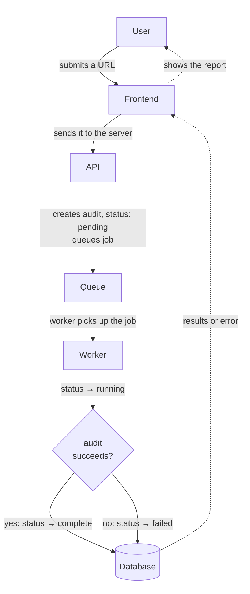

# Speedhawk Audit Flow

Carries the audit's status along the same loop: `pending` when queued, `running` once picked up, then it forks into `complete` or `failed`.

┌──────────┐   POST /api/audits    ┌──────────┐   enqueue job     ┌───────────┐
│  CLIENT  │ ────────────────────► │  SERVER  │ ───────────────►  │   REDIS   │
│  React   │                       │ Express  │   (BullMQ queue)  │  (queue)  │
│  + Vite  │ ◄──── poll GET ───────│          │                   └─────┬─────┘
└──────────┘   /api/audits/:id     └────┬─────┘                         │ pulls job
                                        │                          ┌────▼──────┐
                                     writes/reads                  │  WORKER   │
                                        │                          │ Lighthouse│
                                   ┌────▼─────┐                    │ Puppeteer │
                                   │ POSTGRES │ ◄──── writes ───── │  Gemini   │
                                   └──────────┘   results          └───────────┘
